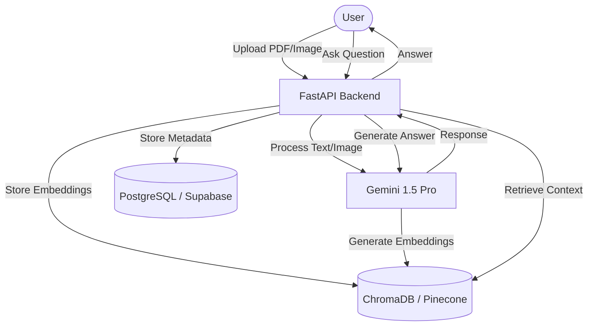

# InsightEngine: Knowledge Retreival Assistant

A "Research Assistant" platform leveraging Advanced RAG and Multimodal AI.

Screenshots

## System Architecture

## Features

1.  **Advanced RAG**: Hybrid search (semantic + keyword) for precise answers.
2.  **Multimodal Capabilities**: Visual search and cover scanning using Gemini 1.5 Pro.
3.  **Writing Coach Agent**: Smart editor for style critique based on genre.

## Tech Stack

-   **LLM / Brain**: Gemini 1.5 Pro (1M+ token context window).
-   **Backend**: FastAPI (High-performance ML API).
-   **Database**: Supabase / PostgreSQL (Metadata).
-   **Vector DB**: ChromaDB / Pinecone (Embeddings).

## Evaluation Metrics

We use Ragas / DeepEval to evaluate the RAG pipeline accuracy:
-   **Context Precision**: How relevant are the retrieved chunks?
-   **Answer Relevancy**: Does the generated answer address the query?
-   **Faithfulness**: Is the answer supported by the retrieved context?

## Live Demo

[Link to Live Demo (Coming Soon)]

## Setup

1.  Clone the repository.
2.  Install dependencies: `pip install -r requirements.txt`
3.  Set up environment variables in `.env`.
4.  Run the backend: `uvicorn backend.main:app --reload`
